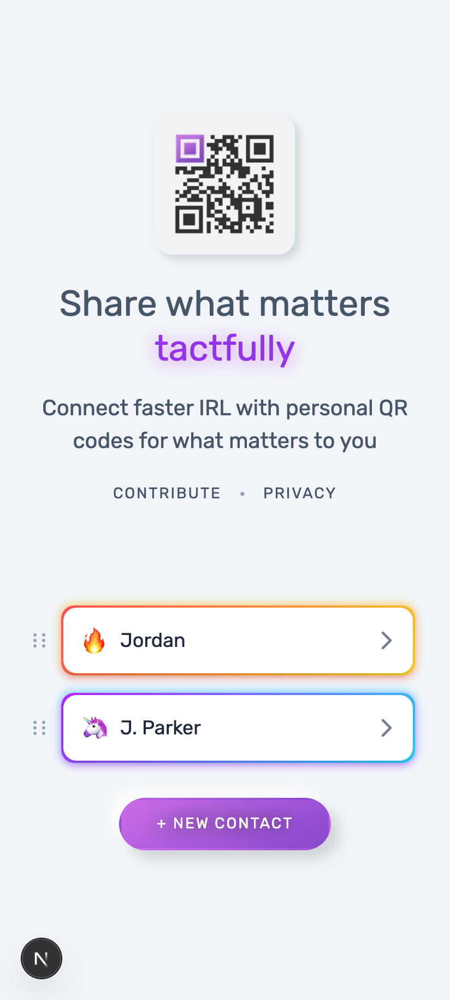
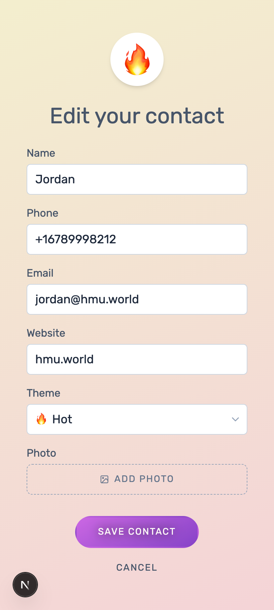

# hmu.world

[](https://github.com/stedmanhalliday/hmu/actions/workflows/ci.yml)
[](https://codecov.io/gh/stedmanhalliday/hmu)
[](./LICENSE)

**Connect faster IRL with personal QR codes for what matters to you.**

[hmu.world](https://hmu.world) is a progressive web app that lets mobile users create personal QR codes for their social links, contact info, and more — all stored locally on their device.

<p align="center">
  
  
  
</p>

## Features

- **Personal QR codes** — Share your contact card, social links, and custom URLs via scannable QR codes
- **20+ platforms** — Instagram, TikTok, X, WhatsApp, Signal, Telegram, Spotify, GitHub, LinkedIn, Venmo, and more
- **Magic Messages** — QR codes that generate pre-drafted emails or SMS messages when scanned
- **Multiple contacts** — Create up to 3 contact profiles with drag-and-drop reordering
- **Privacy-first** — All data stored locally on your device. No accounts, no servers, no tracking of personal data
- **Installable PWA** — Works offline and installs like a native app on iOS and Android
- **Customizable themes** — Animated gradient backgrounds with emoji avatars or profile photos

## Tech Stack

- [Next.js](https://nextjs.org/) (Pages Router)
- [React 18](https://react.dev/)
- [Tailwind CSS](https://tailwindcss.com/)
- [@ducanh2912/next-pwa](https://github.com/AugmentedWeb/next-pwa) for service worker and PWA support
- [qrcode](https://github.com/soldair/node-qrcode) for QR code generation
- [@dnd-kit](https://dndkit.com/) for drag-and-drop
- localStorage for private, on-device data persistence

## Getting Started

```bash
# Install dependencies
yarn install

# Start the development server
yarn dev
```

Open [http://localhost:3000](http://localhost:3000) in your browser.

## Scripts

| Command | Description |
|---------|-------------|
| `yarn dev` | Start development server |
| `yarn build` | Production build |
| `yarn start` | Start production server |
| `yarn lint` | Run ESLint |
| `yarn test` | Run tests |
| `yarn test:coverage` | Run tests with coverage report |

## Contributing

Feedback, bug reports, and code contributions are welcome!

- **Report bugs** or **request features** via [GitHub Issues](https://github.com/stedmanhalliday/hmu/issues)
- **Email**: [sup@hmu.world](mailto:sup@hmu.world?subject=hmu.world%20Feedback)
- **X (Twitter)**: [@stedmanhalliday](https://x.com/stedmanhalliday)

## License

[MIT](./LICENSE) © Stedman Halliday
